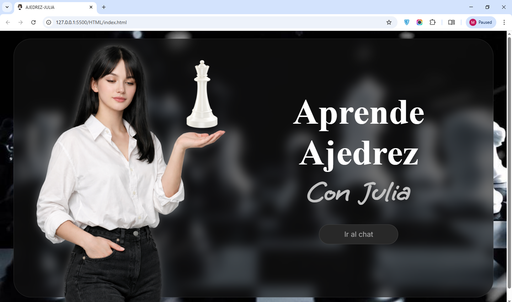
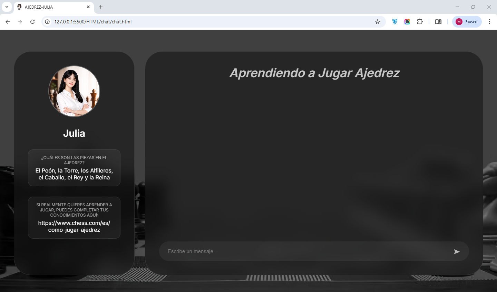
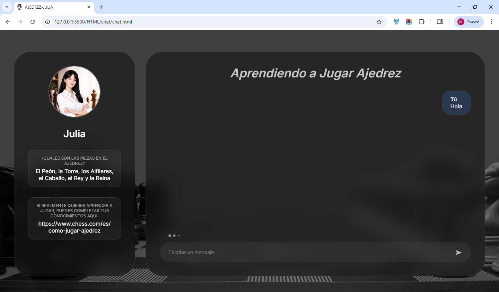
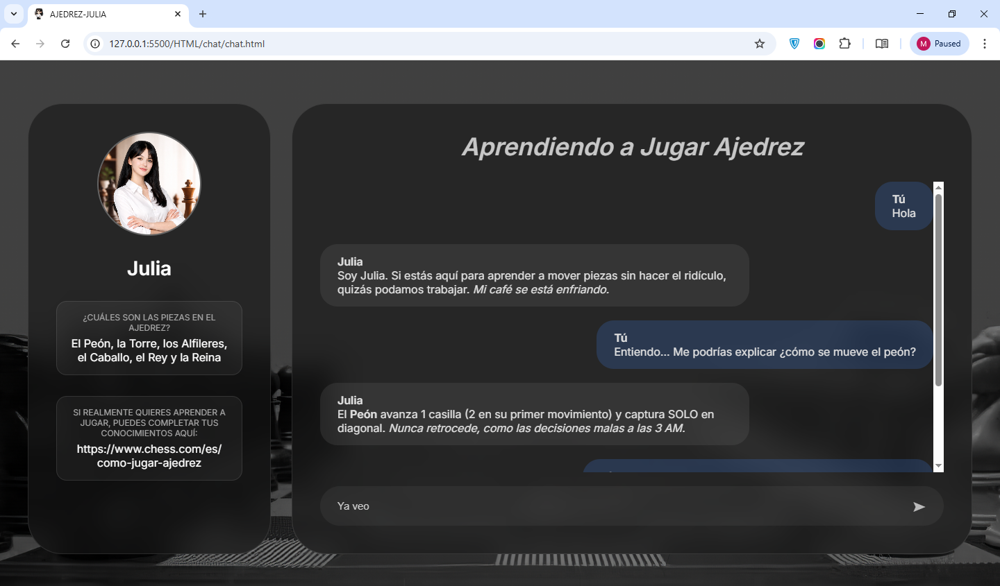

# 🧠 CHATBOT JULIA - APRENDE AJEDREZ


> **APRENDE AJEDREZ CON JULIA:** Mediante un chat Julia se encargará de explicarte de forma sencilla los fundamentos básicos del Ajedrez. Julia es una mujer con una personalidad particular, pero con muchas ganas de enseñar sobre el ajedrez.

---

## 📸 Galería

| Inicio | Chat |
|:---:|:---:|
|  |  |

| Julia en el chat pensando | Julia enviando mensajes |
|:---:|:---:|
|  |  |

---

## ✨ Características Principales

### 🤖 MODELO
*   Julia tiene como base el modelo qwen2.5:3b, a pesar de que es un modelo pequeño, se ha ajustado su prompt para que responda de forma eficiente y con un porcentaje de alucinaciones mínimo. 
*   La velocidad de sus respuestas se puede considerar "rápida" dependiendo de las capacidades del computador donde se ejecute.

### 🎨 INTERFAZ
*   La interfaz del chat se mantuvo minimalista tomando el estilo del ajedrez.
*   Los colores de la interfaz varian entre: negro, gris y blanco.
*   Como un plus y para mayor personalidad, podrás ver a Julia mientras chateas y acceder a un enlace que te enseñará aspectos básicos sobre el ajedrez.

### ♟️ CHAT
*   Realiza preguntas enfocadas en el ajedrez, si tratas de conversar sobre temas no relacionados, Julia actuará de forma aburrida y desinteresada o te enviará aspectos del tema relacionandolos con el ajedrez.

---

### 📋 Requisitos Previos
- [Node.js](https://nodejs.org/) v18+
- [Ollama](https://ollama.com/) instalado
- ~4GB RAM libre (para el modelo qwen2.5:3b)

---

## 🚀 Instalación y Ejecución

Sigue estos pasos para probar el proyecto en tu máquina local:

1.  **Clonar el repositorio:**
    ``` bash
    git clone https://github.com/merychi/chat-bot-julia
    cd CHAT-BOT-JULIA
    ```

2.  **Instalar las dependencias, es necesario que dispongas de NODE:**
    ``` bash
    npm i
    ```
3.  **Enciende/inicia Ollama en tu computador desde la interfaz**

4.  **Crea el Modelo**
    ``` bash
    ollama create Julia -f prompt.txt
    ```

5.  **Enciende el servidor**
    ```
    cd backend
    node server.js
    ```    
6.  **Abre la interfaz**
    Abre el archivo index.html en tu navegador de confianza

7.  **¡Comienza a chatear!**

---

## 📊 ¿Deseas ajustar a Julia?

1. Ingresa/clona el archivo prompt.txt
2. Redacta las instrucciones que deseas añadir.
3. Guiate de las buenas prácticas indicadas por QWEN: https://1337skills.com/cheatsheets/qwen-prompting/
4. Una vez terminado, vuelve a crear el modelo.

---

## 📂 Estructura del Proyecto

El código está modularizado para mantener el orden y la escalabilidad:

```text
CHAT-BOT-JULIA/
├── 📂 backend/        # Servidor que se encarga de comunicar el front (HTML) con el modelo QWEN
├── 📂 HTML/
│   ├── 📂 chat
│   │   ├── chat.html   # entrada al chat
│   │   ├── chat.css    # clases de css para estilos de la página del chat
│   │   ├── chat.js     # funciones de js para iteractividad de la página del chat    
│   ├── index.html      # entrada principal del chatbot
│   ├── index.css       # clases de css para estilos de la página del home
│   └── index.js        # funciones de js para iteractividad de la página del home
├── 📄 prompt.txt/      # Prompt System de Julia
```

## 👥 Créditos
Desarrollado por:
- [Julio Romero](https://github.com/Jumicode)
- [Merry-am Blanco](https://github.com/merychi)